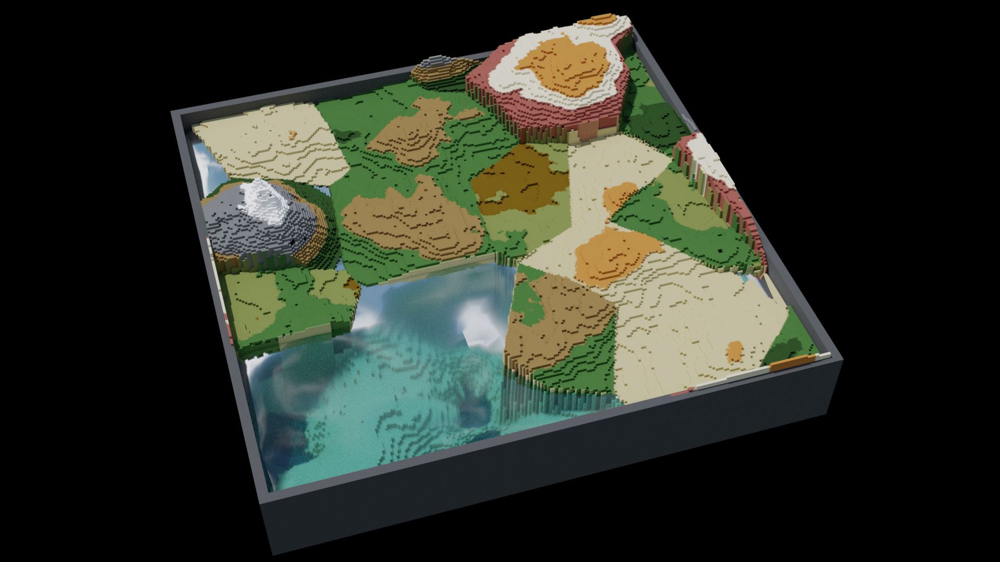

# 15418 Final Project: Parallel Terrain Generation
Hi! This repository is for our 15-418 Final Project on Parallel Terrain Generation.



Website: https://vzayakov.github.io/418FinalProject/

## Building the Parallel/CUDA Code
Dependencies: Make, g++.

Hardware Requirements: A machine with an Nvidia GPU with NVCC (CUDA) installed.

First, clone the repository locally:
```
git clone https://github.com/vzayakov/15418-FinalProject.git
```
To compile the code and run the executable, you can use the bash script if you're on a Linux machine:
```
chmod +x terraingen.sh
./terraingen.sh
```
Otherwise, you need to manually "make" the code and then run the executable:
```
make clean
make
./terraingen -f <filename> -h <height> -w <width> -o <octaves> -p <persistence> -l <lacunarity> -s <scale>
```
Note that the program's hyperparameters need to be passed in as command-line arguments to the executable.

## Rendering the Generated Terrain
When the terraingen exectuable is run, it will output a Perlin heightmap and a Voronoi biome map into two separate .txt files.

These can be visualized in 2D using the "visualizeMap.py" script, inside the "python" folder:
```
python3 visualizeMap.py
```
Furthermore, the Voronoi map can be combined with the Perlin map to add biomes to the procedurally generated terrain. The Voronoi map is interpreted as six different biomes: Mountains, Desert, Plain, Hill, Dirt, and Mesa. This can be done with the biomeGen.py script:
```
python3 biomeGen.py
```
Make sure to modify the relevant paths in the script files to point to the right .txt files.

Finally, the resulting biome height map can be rendered in Blender, by deforming a "plane" object by applying the height map to it. The resulting object can be "remeshed" to give it a Minecraft-like Voxel look.

